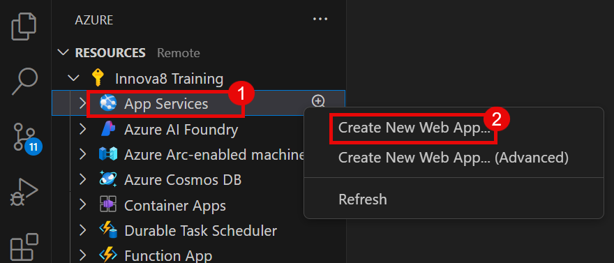

# App Service Deployment Manual

## Objective
Deploy a simple Flask web application with HTML templates to Azure App Service directly from Visual Studio Code using the Azure App Service extension. This guide helps developers set up the project structure, and deploy the app, ensuring it runs smoothly as a publicly accessible web service on Azure.

## Task 1: Deployment through VS Code
In this Exercise we will be first configuring the VS code and then deploy our Web App using the VS Code.  

1. From the Desktop, open **Visual Studio Code (1)**.    
   

2. From the Activity Bar on the left, select **Extensions(1)** and using the **Search Bar**, look for the **Azure App Service (2)**       extension and click on **Install (3)**.
   
   

3. In the same manner, click on **Install (4)** for **Azure Resources** extension as well.    

   

4. From the Activity Bar on the left side, select **Azure (1)**.  

   

5. Select **Sign in to Azure (2)** from the Resources drop-down to sign in to your Azure account.  

   

6. From the Pop-up windows, Select **Allow (1)** to sign in using Microsoft.   

   

7. Enter your Azure **Email Address (1)**, Click on **Next (2)** to Sign in.  

   

8. After Sign in to Azure Account, Select **App Services (1)** from the Resources and click on **Create New Web App (2)**.  

   

9. Select a location for your app service as **Southeast East (3)**.  

   

10. Provide a unique name for your Web App, **myapp-latest (4)**.  

   

11. Select a runtime stack for your web app as **Python 3.9 (5)**.  

   

12. Select the Pricing Tier as **Basic (B1) (6)**.  

   

13. From the Pop-up window, click on **Deploy (1)** to deploy your web app on azure.  

   

14. Navigate to the folder which contains the code and other required files i.e., **myapp (1)**.  

   

15. In the Pop-up window, click on **Deploy (1)**.  

   

16. After the deployment has completed, Click on **Browse Website (1)** from the Pop-up window.  

   

17. Your Web App will open in a new tab on the browser.    
   

