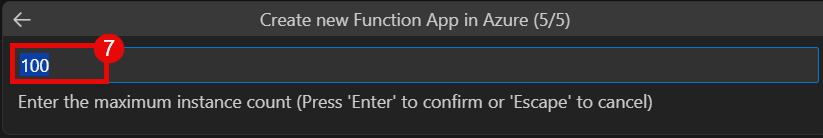

# Function App Deployment Manual
## Objective :
In this lab, you will create an Azure Function App using the Azure Portal. This hands-on exercise guides you through the essential steps to deploy a serverless compute resource in Azure. By the end of the lab, you will understand how to configure a Function App, deploy and test a simple function, and manage basic settings. You will also gain foundational knowledge of Azure’s serverless architecture and its event-driven execution model.

## Tasks :
1. Creating an Azure Storage Account via the Azure Portal — this storage account will be used to support the function app's infrastructure.

2. Creating an Azure Function App from within Visual Studio Code, including configuring the runtime and environment.

3. Developing a Blob Trigger function locally in VS Code.

4. Deploying the function to Azure directly from Visual Studio Code, validating successful integration with the storage account.

### Task 1 : Create an Azure Storage Account
 1. Go to [Azure Portal](https://login.microsoftonline.com/organizations/oauth2/v2.0/authorize?redirect_uri=https%3A%2F%2Fportal.azure.com%2Fsignin%2Findex%2F&response_type=code%20id_token&scope=https%3A%2F%2Fmanagement.core.windows.net%2F%2Fuser_impersonation%20openid%20email%20profile&state=OpenIdConnect.AuthenticationProperties%3DqsxJ_h_KR0vAGL38j_E6NEOfPT89BBzyfiaJd0o_aZu89ZU2BfV4d-NjF3ckuwbcbNd9ZSmbNrLyTPsB0rWUflEMhXiSYwxIx3zGyeejW01DZjYmyLhfxqeDyW8DpNNkB0jaNXoEnvqCG4atochKbS-G-SCu7pXezUSIJyPQfYzAj3el_P5qyHPEM5WTTmnA&response_mode=form_post&nonce=638816784146084860.NGNhODI3MmUtOTc2ZS00NTA5LTkwM2YtMGVjZjg2ZmMxMDYwMjc0YmJmNTktMWJmZS00NzczLWE5MjItNTM3OTNkZTBmNmI0&client_id=c44b4083-3bb0-49c1-b47d-974e53cbdf3c&site_id=501430&prompt=select_account&client-request-id=90700cc0-64fe-4d3d-8694-5c55fe4ca558&x-client-SKU=ID_NET472&x-client-ver=8.3.0.0).  

 2. Enter your Azure **Email Address (1)**, Click on **Next (2)** to Sign in.

      

 3. On the Azure portal, click on search bar, search for **Storage Account (1)**, and select **Storage Account (2)**.  

      

 4. Click on **Create (1)** to create a storage account.  
  
      
 
 5. Fill the following details:  
    | Type | Value |
    |:---:|:---:| 
    | Resource Group | **anand.shekhawat02 (1)**|  
    |Storage account name | **anandlabs147 (2)**|
    |Region|**Canada Central (3)**|

      

6. |Type | Value|  
    |:---:|:---:|
    |Primary Service|**Azure Blob Storage (4)**|
    |Performance|**Standard (5)**|
    |Redundancy|**LRS (6)**|
    
    Click **Review + Create (7)**.
    

7. Click on **Create (8)** to create the storage account.

    

8. After the deployment, Click on **Go to resource (9)**, to go to storage account.  

    

9. From the left panel, use Drop-down of **Data Storage (1)**, Click on **Container (2)**.
    
    

10. To create Container click on **Container (3)**.  

    

11. Provide the name of container as **Container (1)**. Click on **Create (2)**.  

    

### Task 2 : Create and Deploy Function App  
1. From the desktop, open **Visual Studio Code (1)**.
    
      

2. From the Activity Bar on the left, select **Extensions(1)** and using the Search Bar, look for the **Azure Functions (2)** extension and click on **Install (3)**.

    

3. In the same manner, click on **Install (5)** for **Azure Resources (4)** extension as well.

    

4. From the Activity Bar on the left side, select **Azure (1)**.

      

5. Select **Sign in to Azure (2)** from the Resources drop-down to sign in to your Azure account.  

    

6. From the Pop-up windows, Select **Allow (1)** to sign in using Microsoft.  
 
    

7. Enter your Azure **Email Address (1)**, Click on **Next (2)** to Sign in.

      

8. In Resources, right-click on **Function App (1)**, select **Create Function App in Azure (2)**.

    

9. Enter name as **blobtriggeredfunctionapp (3)** for the new Function app.

    

10. Select the location **Sweden Central (4)** for the Function app.

    

11. Select the runtime stack as **Python 3.11 (5)**.

    

12. Select **2048 (6)** as the instance memory size for function app.

    

13. Enter **100 (7)** as the maximum instance count.

    

### Task 3 : Create and Deploy Function 

1. In the VS Code, Press **F1** and search **Create Function (1)**, and select **Azure Functions: Create Function (2)**.

    

2. Select the folder **blob function (3)**, this folder will contain the function.

    

3. Select **Python (4)** as a language. 

    

4. Select **Skip Virtual environment (5)**.

    

5. Select **Blob trigger (6)** as the template for the function.

    

6. Give this function name as **blobtriggerfunc (7)**.

    

7. Provide **Container/{name}.png (8)** as the path in the storage account that trigger will monitor.

    

8. Click on **Create new local app setting (9)**.
    
    

9. Select **Innova8 Training (10)** as the subscription.

    

10. Select **Azurite emulator for local storage (11)**.

    

11. Open Azure Portal, and storage account. In drop-down of **Security + Networking (1)**, select **Access keys (2)**.

    

12. Copy the **Connection String (3)**.

    

13. Go back to VS code and local.settings.json, Paste the connection string in **AzureWebJobsStorage (1)**.

    .png)

14. From the Activity bar on the left, go to **Azure (1)**.

    .png)

15. From the workspace, right click on **Local Project (2)**, and select **Deploy to Azure (3)**.

    .png)

16. Select **Innova8 Training (1)** as a subscription.

    .png)

17. Select the Function app which we created earlier **blobtriggeredfunctionapp147 (2)** to deploy our function.

    

18. From the Pop-up window, click on **Deploy (1)**.

    

19. Function Deployed Successfully.

    

### Task 4 : Testing the Function App

1. Go to Azure Portal, and search for **Function App (1)**, click on **Fucntion App (2)**.

    

2. From the list of Function Apps, select **blobtriggeredfunctionapp (1)**.

    

3. In the new Tab, open Storage Account and **upload (1)** a .png file to the blob container.

    

4. From the pop-up window, click on **Browse for files**.

    

5. From the Pop-up windows, **select (1)** the .png file you want to upload and click on **Open (2)**.

    

6. Click on the **Upload (1)**.

    

7. From the Left tab in Azure Function App go to the Settings and click on **Environment Variable (1)**.
    
    

8. Click on **Add (2)**, to add an environment variable.

    

9. Click on **Add (2)**. 

    

10. In the Add/Edit application setting window, add name **AzureWebJobsStorage (1)**, in the value add **Connection String (2)** we copied from storage account, click on **Apply (3)**.  

        

10. Go to the Azure Function App tab in the browser, in the Overview tab, go to Function **blobtriggerfunc (1)**.

    

11. In the logs, we can see the function getting triggered.
    
    