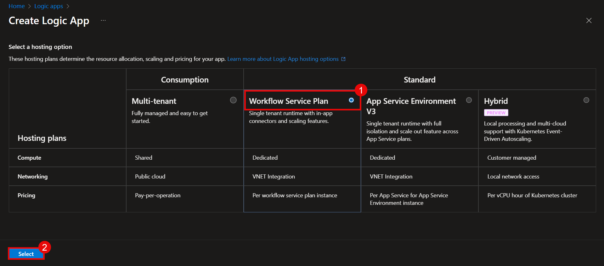

# Logic App Deployment Manual
## Objective :

To deploy an Azure Logic App that is triggered via an HTTP request and sends a predefined email notification to a specified recipient. This setup enables integration with external systems or custom applications that can initiate the Logic App by calling its HTTP endpoint, allowing event-based email alerts without writing any custom code.

### Task 1 : 

1. Go to [Azure Portal](https://login.microsoftonline.com/organizations/oauth2/v2.0/authorize?redirect_uri=https%3A%2F%2Fportal.azure.com%2Fsignin%2Findex%2F&response_type=code%20id_token&scope=https%3A%2F%2Fmanagement.core.windows.net%2F%2Fuser_impersonation%20openid%20email%20profile&state=OpenIdConnect.AuthenticationProperties%3DqsxJ_h_KR0vAGL38j_E6NEOfPT89BBzyfiaJd0o_aZu89ZU2BfV4d-NjF3ckuwbcbNd9ZSmbNrLyTPsB0rWUflEMhXiSYwxIx3zGyeejW01DZjYmyLhfxqeDyW8DpNNkB0jaNXoEnvqCG4atochKbS-G-SCu7pXezUSIJyPQfYzAj3el_P5qyHPEM5WTTmnA&response_mode=form_post&nonce=638816784146084860.NGNhODI3MmUtOTc2ZS00NTA5LTkwM2YtMGVjZjg2ZmMxMDYwMjc0YmJmNTktMWJmZS00NzczLWE5MjItNTM3OTNkZTBmNmI0&client_id=c44b4083-3bb0-49c1-b47d-974e53cbdf3c&site_id=501430&prompt=select_account&client-request-id=90700cc0-64fe-4d3d-8694-5c55fe4ca558&x-client-SKU=ID_NET472&x-client-ver=8.3.0.0).

2. Enter your Azure **Email Address (1)**, Click on **Next (2)** to Sign in.

    

3. On the Azure portal, click on global search bar, search and select **Logic App (1)**.  

      

4. From the window of Logic App, Click on **+ Add (1)**.

    

5. From the select a hosting option, choose **Workflow Service Plan (1)**, and click on **Select (2)**.

    

6. 