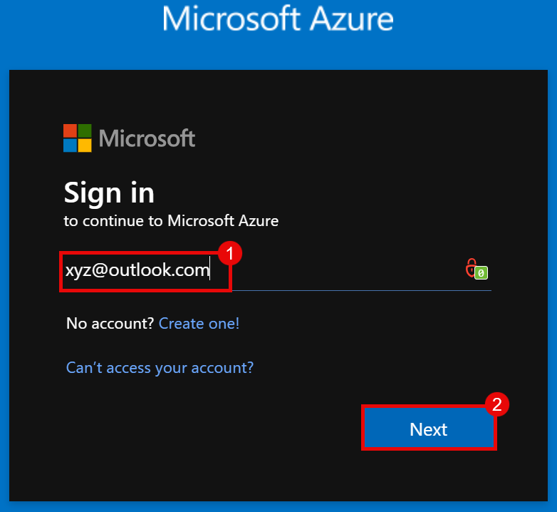
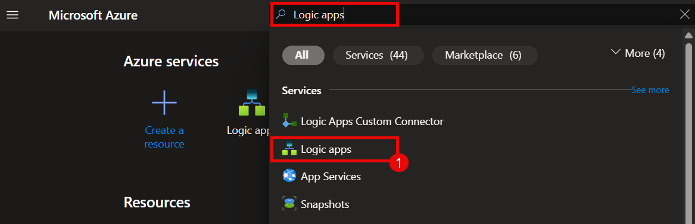
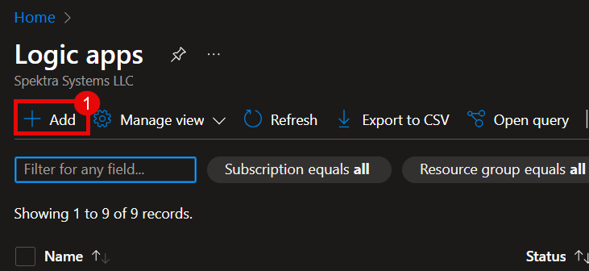

# Automated Email Response and Teams Notification Using Azure Logic Apps
## Overview :

In this step-by-step guide, you'll create an Azure Logic App (Consumption) that automatically replies to incoming Outlook emails based on specific keywords in the subject or body—such as "leave," "invoice," or "urgent." When such keywords are detected, the app sends a contextual auto-reply to the sender and posts a notification to the owner via Microsoft Teams chat. Through this exercise, you'll learn how to use connectors like Microsoft 365 Outlook and Teams, apply conditional logic, and integrate multiple actions to automate communication workflows efficiently.

## Tasks to be done :

- **Task 1** : Create a Logic App.
- **Task 2** : Validate Logic App Functionality.  

### Task 1 : Create a Logic App

1. Go to [Azure Portal](https://login.microsoftonline.com/organizations/oauth2/v2.0/authorize?redirect_uri=https%3A%2F%2Fportal.azure.com%2Fsignin%2Findex%2F&response_type=code%20id_token&scope=https%3A%2F%2Fmanagement.core.windows.net%2F%2Fuser_impersonation%20openid%20email%20profile&state=OpenIdConnect.AuthenticationProperties%3DqsxJ_h_KR0vAGL38j_E6NEOfPT89BBzyfiaJd0o_aZu89ZU2BfV4d-NjF3ckuwbcbNd9ZSmbNrLyTPsB0rWUflEMhXiSYwxIx3zGyeejW01DZjYmyLhfxqeDyW8DpNNkB0jaNXoEnvqCG4atochKbS-G-SCu7pXezUSIJyPQfYzAj3el_P5qyHPEM5WTTmnA&response_mode=form_post&nonce=638816784146084860.NGNhODI3MmUtOTc2ZS00NTA5LTkwM2YtMGVjZjg2ZmMxMDYwMjc0YmJmNTktMWJmZS00NzczLWE5MjItNTM3OTNkZTBmNmI0&client_id=c44b4083-3bb0-49c1-b47d-974e53cbdf3c&site_id=501430&prompt=select_account&client-request-id=90700cc0-64fe-4d3d-8694-5c55fe4ca558&x-client-SKU=ID_NET472&x-client-ver=8.3.0.0).

2. Enter your Azure **Email Address (1)**, Click on **Next (2)** to Sign in.

    

3. On the Azure portal, click on global search bar, search and select **Logic App (1)**.  

      

4. From the window of Logic App, Click on **+ Add (1)**.

    

5. From the select a hosting option, choose **Consumption (1)**, and click on **Select (2)**.

    .png)

6. In the Create Logic App page, provide a unique **Logic App name (1)** and choose the Region as **Southeast Asia (2)**, click on the **Review + create (3)**.   

    .png)

7. Click on **Create (4)**, to create the logic app.  

    .png)

8. Click on **Go to resource**, to go to the newly create logic app.  

    .png)

9. From the left panel, select **Logic app designer** to create the flow of the logic app.  

    .png)

10. Click on **Add a trigger** to create a trigger for the logic app.  

    .png)

11. From the window that opens on the right, using the **Search Box (1)** look for and select **When a new email arrives (2)**.  

    .png)

12. Provide the **Connection Name** as **"new-connection" (1)** .  

    .png)

13. In the pop-window, provide the work **Email (1)** and click **Next (2)** to sign in.  

    .png)

14. Click on the **(+)** to **Add an action**.  

    .png)

15. In the search bar, Search and select **Condition**.    

    .png)

16. In the condition window, from the **Drop-Down (1)**, select **OR (2)** operator.   

    .png)

17. In the Condition, for the subject select **Insert expression** **"fx"**.  

    .png)

18. In the pop-up window, insert **"toLower(triggerBody()?['Subject'])" (1)** in the box and click on **Add (2)**.  

    .png)

19. Click on the **Drop-down (4)** for the condition and select **contains (5)**.  

    .png)

20. In the value box, insert **"Leave" (6)**.  

    .png)

21. Click the Drop down **+ New item (7)**, select **Add row (8)**.  

    .png)

22. Repeat the same process for the words like **Urgent** and **Invoice**.  

    .png)

23. Click on **(+)** under the True and select **Add an action**.  

    .png)

24. Using the search bar, **Search** and select **Send email (V2)**.  

    .png)

25. Provide the personal email **personal.email@gmail.com (1)**.   

    .png)

26. From the **Drop-down (2)** in the advance properties, select **Subject (3)** and **Body (4)**.  


    .png)

27. In the Subject section, insert **triggerBody()?['Subject'] (5)** and for the **Body section (6)** of the email, copy the content given below:   
    ```
    Hi,

    Thank you for your message regarding "@{triggerBody()?['Subject']}". We've received it and will get back to you shortly.

    Best regards,
    Auto-Reply System
    ```

    .png)

28. Click on **(+)** below Send email (V2) and select **Add an action**.  

    .png)

29. Using the Search box, search for and select **Post message in a chat or channel**.  

    .png)

30. Click on **Sign in** to login to Microsoft teams account.  

    .png)

31. Provide the Microsoft teams **Email (1)** and click on **Next (2)** to login.  

    .png)

32. In the parameters tab, from Post In **Drop-down (1)** select **Chat with Flow bot (2)**.  

    .png)

33. In the Recipient provide the email as **Microsoft Teams Email Id(3)**, and in the **Message (4)** write the following message:
    ```
    New email received with subject: "@{triggerBody()?['Subject']}"
    From: "@{triggerBody()?['From']}"

    ```

    .png)

34. From the Logic app designer, click on **Save** to save workflow for the logic app.  

    .png)


### Task 2 : Validate Logic App Functionality  

1. From the peronal email id, write an email to the work email address provided in the logic app, requesting leave from work, using the word **Leave** in the subject line.   

    .png)

2. After an email with **Leave** in the subject is received, an auto-generated response will be sent to the personal email address.  

    .png)

3. A notification in the form of a new chat is also received on the Microsoft teams chat.  

    .jpg)

## Review
In this lab you have completed the following:

- Created a Logic App
- Validated the Logic App Functionality

#### You have successfully completed this workshop!
