## **Objective:**  
To create a Linux Virtual Machine in Microsoft Azure using the Azure Portal. This involves selecting the appropriate subscription, resource group, region, VM size, authentication method, and OS image. The goal is to deploy a fully functional VM for development or testing purposes.

# Tasks : 
- Login 
- Creation of VM
- Connection

## Task 1 : Log in to the Azure Portal

- Go to: [https://portal.azure.com](https://portal.azure.com) 
- Enter your **credentials (1)** to log in to azure. Click on **Next (2)** to enter the password.
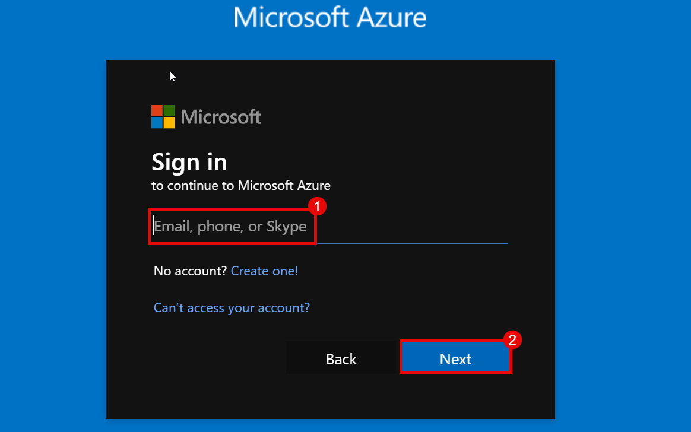

## **Tasks 2 : Creation**  

1. On the Azure portal, click on search bar, search for **Vitutual machine (1)**, and select **Vitutual machine (2)**.
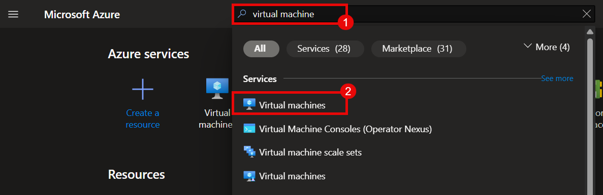
2. Click on **Create (1)** and Select **Azure Virtual Machine (2)**.
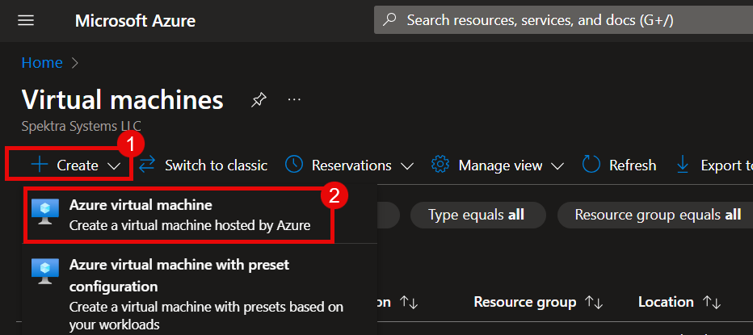

3. In **Basics Tab** put the value as mentioned in the table.

	We need to fill in the basic configuration details:  
	| Settings | Values |
	|:---: | :---:|
	|Subscription | **Azure (1)**|
	|Resource Group | **RG-01 (2)** |
	| Virtual Machine  | **VM-01 (3)**|
	|Region  | **South India (4)**|

	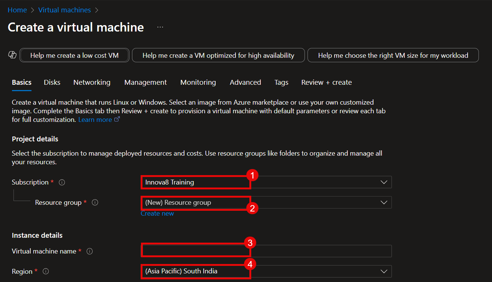

4. Select the value as mentioned in the table.
	| Settings | Values |
	|:---: | :---:|
	|Availability Options | **No infrastructure redundancy required (5)**|
	|Security Type  | **Trusted Launch Virtual Machine (6)**|
	|Image| **Ubuntu Server 22.04 LTS - x64 (7)**|
	|Size | **Standar_B2ms (8)**|

	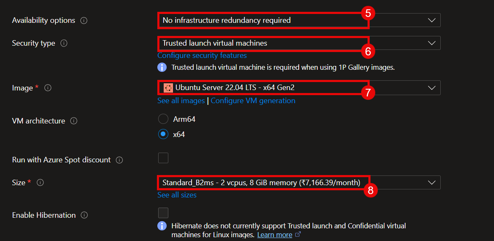  
5. Give Username and Password for your machine.
	| Settings | Values |
	|:---: | :---:|
	|Username|**azureadmin (9)**|
	|Password|**Password1234! (10)**|
	|Confirm Password|**Password1234! (11)**|

	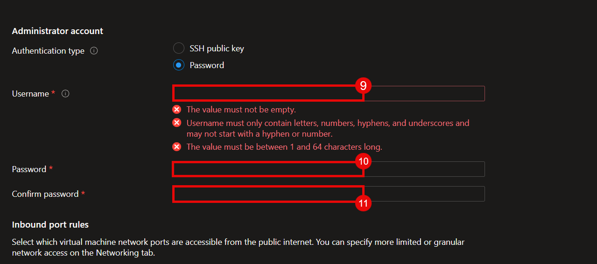
6. Click on **Next : Disks > (13)** after selecting **Public Inbound ports** as **Port 80 (12)**. 
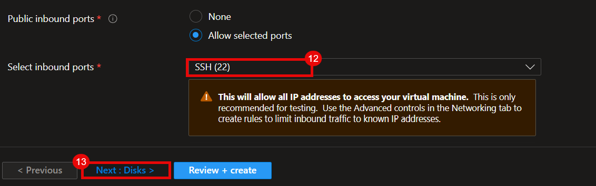

7. In Disks Tab use the following value and keep everything else as **default**.  
	|Settings|Values|
	|:---:|:---:|
	|OS Disk Size|**Image Default(30GB) (1)**|
	|OS Disk Type|**Premium Standard SSD (2)**|
    
	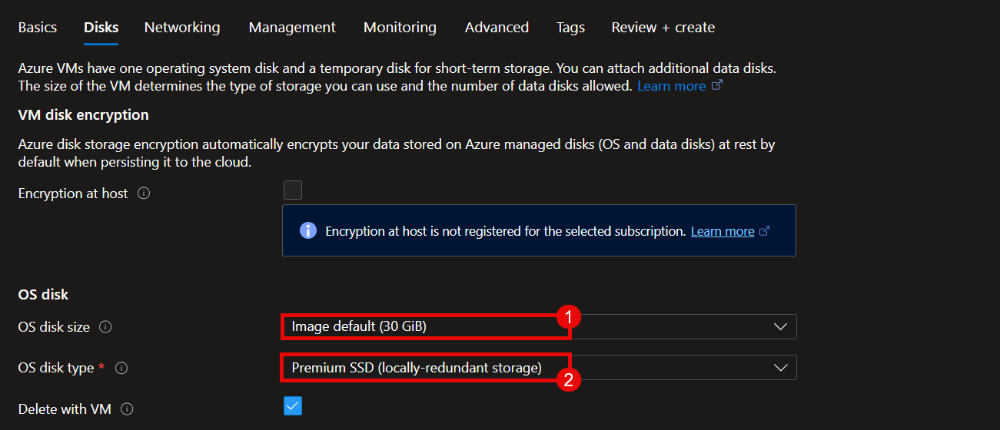  

8. Click on **Next : Networking > (3)**
	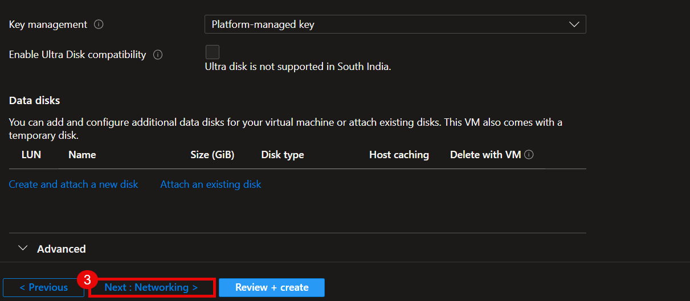

9. Networking Tab check the following values and keep everything as **default**  
	| Settings | Values |
	|:---: | :---:|
	|Virtual Network| **Vnet-01 (1)**|
	|Public IP| **PIP (2)**|
	|NIC Network Security Group| **NSG (3)**|

	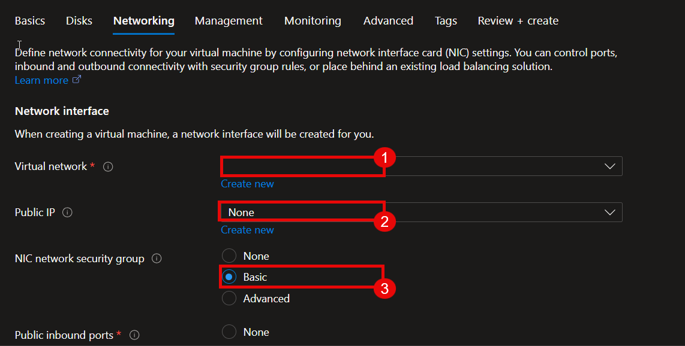
	| Settings | Values |
	|:---: | :---:|
	|Select Inbound ports| **SSH (22) (4)**|
	|Load Balancing | **None (5)**|

	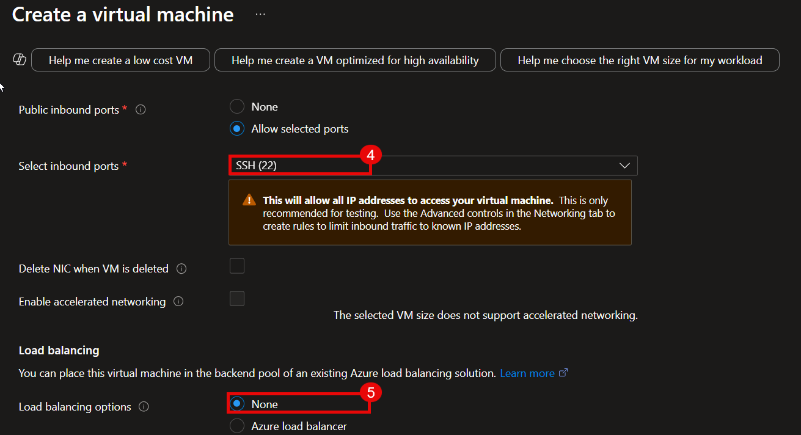
10. Click on **Review + create (6)**.
	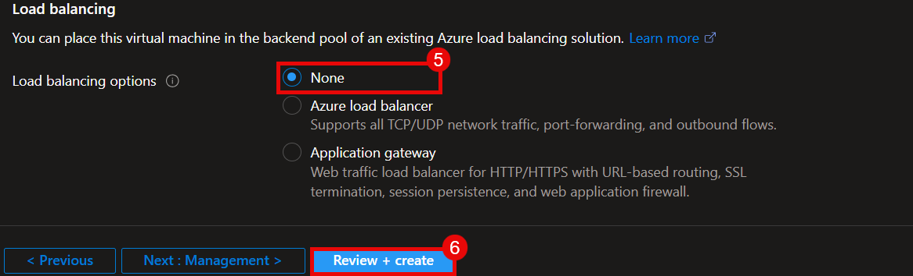

11. After validation is complete click on **Create**.
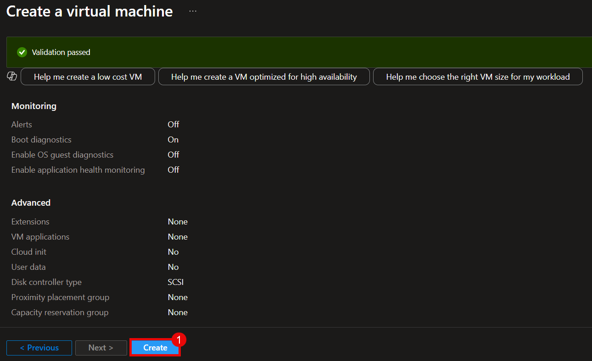

12. After deployment is complete click on **Go to resource**.
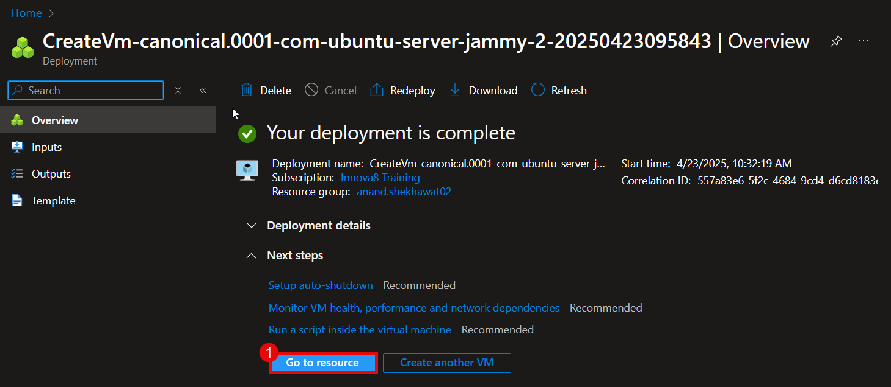

## **Task 3 : Connect to the VM**

1. In order to connect to VM we need to click on **Connect (1)** drop down, click on **Connect (2)**.
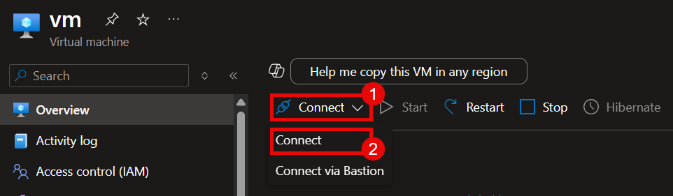
2. Copy the **Public IP (3)** to connect to our Linux VM.
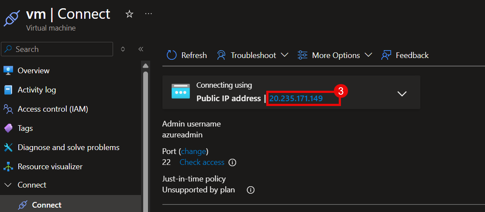

### Connecting Using Putty

3. Open **Putty (1)** and Paste the **Public IP (2)** of your machine. Click on **Connect (3)** to the VM.
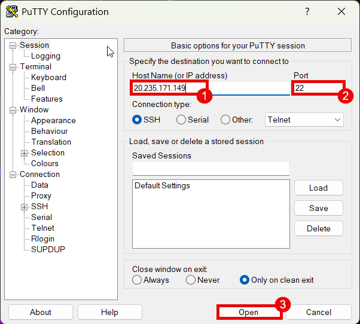

4. Click on **Accept (4)**  
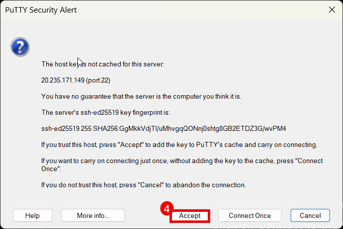
5. Enter the **Username (5)** and 
**Password (6)**.
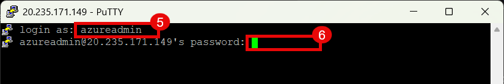

	#### **We are finally connected to our Linux Virtual Machine.**
	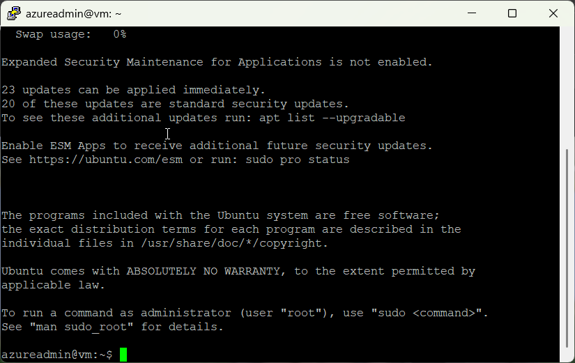

